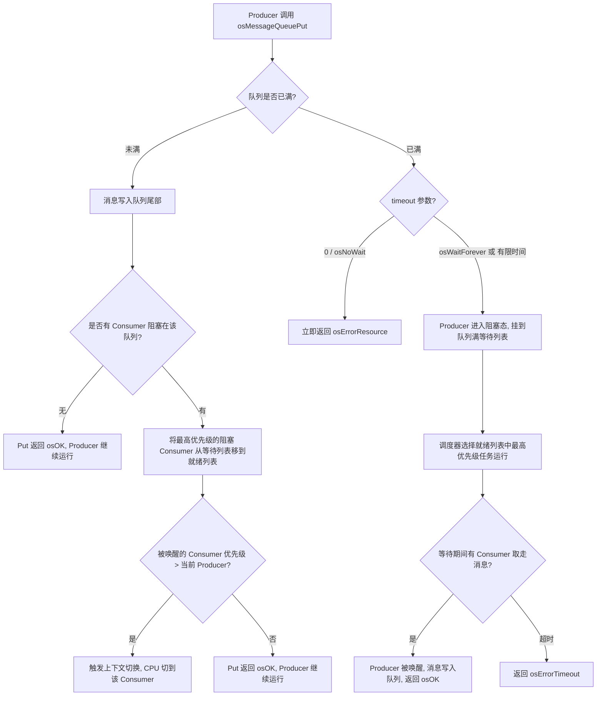
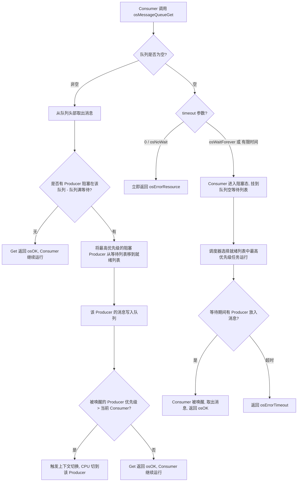
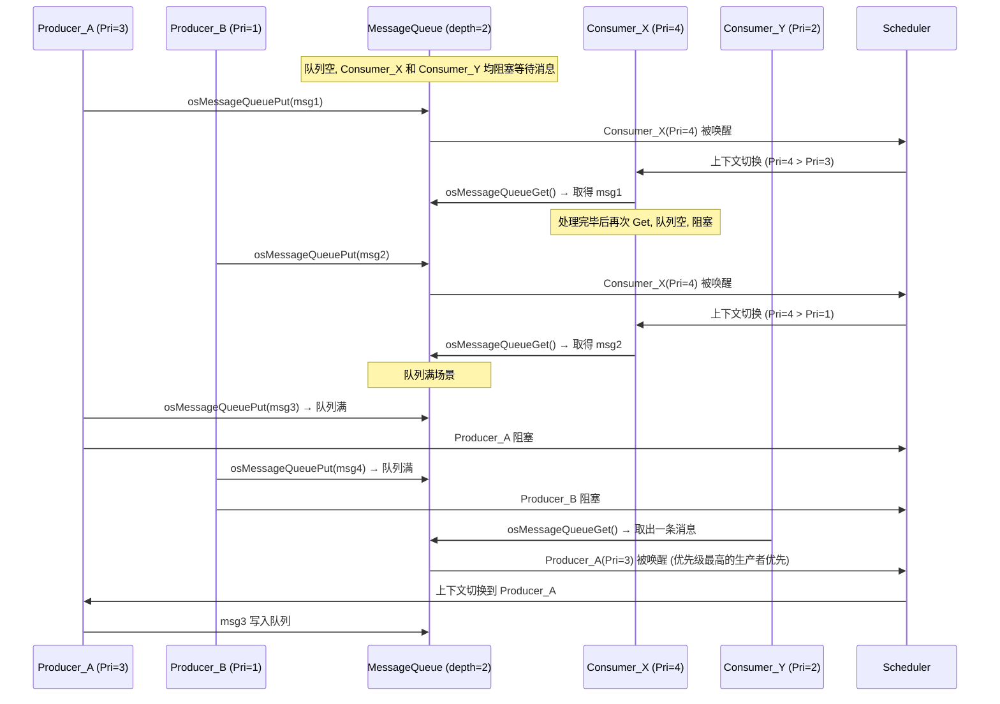

# osMessageQueuePut / osMessageQueueGet 多生产者多消费者任务调度流程

## 系统模型

```
Producer_A (优先级高)  ──┐
Producer_B (优先级低)  ──┼──► [ Message Queue ] ──┬──► Consumer_X (优先级高)
Producer_C (优先级中)  ──┘                        └──► Consumer_Y (优先级低)
```

## osMessageQueuePut 流程（生产者侧）



## osMessageQueueGet 流程（消费者侧）



## 多生产者多消费者竞争调度示例



## 关键调度规则总结

| 场景 | 调度行为 |
|------|----------|
| Put 成功且有阻塞的 Consumer | 唤醒**最高优先级**的 Consumer；若其优先级高于当前任务则立即切换 |
| Get 成功且有阻塞的 Producer | 唤醒**最高优先级**的 Producer；若其优先级高于当前任务则立即切换 |
| 多个同优先级任务阻塞 | 按 FIFO 顺序唤醒（先阻塞的先唤醒） |
| Put 时队列满 / Get 时队列空 | 当前任务进入阻塞态，调度器切换到就绪列表最高优先级任务 |
| ISR 中调用 Put | 不会立即切换；在退出 ISR 时由 PendSV 完成上下文切换 |